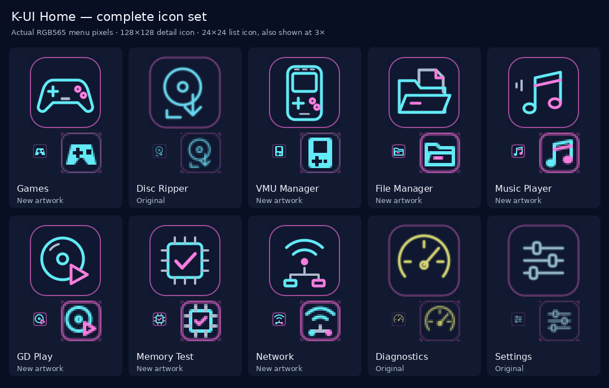

# K-UI NeXT handoff (2026-09-28)

## Standalone storage development (2026-09-30)

The owner reported on 2026-10-01 that setting the clock in K-UI triggers the
Dreamcast BIOS date/time dialog on the next boot. The runtime clock setter now
synchronizes the BIOS last-set timestamp as well as the RTC and KOS cached time.
It preserves the full system configuration record, appends with CRC/readback,
and never erases flash. Invalid/full flash is refused before setting the RTC;
later failures direct the user to the BIOS clock editor. Focused host checks
cover preservation and interrupted writes; console reboot acceptance is still
pending. See [clock details](clock-and-file-dates.md). This is an SD-runtime-only
fix, retaining version 1.5.1 and the `6af5e11` boot CD.

The owner confirmed the final red Card tools menu from `6af5e11a8612` works
(2026-10-01); an initial old-artwork report was resolved after correcting which
file was copied. The `6af5e11` boot CD is ready to burn. Its optional CD-origin
`boot.kui` override and SCI/IDE still await hardware testing. The owner also
requested the identical red image for the SD runtime startup. That artwork-only
card update keeps version 1.5.1, startup sound/timing and the existing CD contract;
it does not require another CD image or burn.

The owner confirmed that the `82984` CD boots normally through SCIF, but loads
slowly. The `18dd87d457fc` corrected bootstrap has now been tested through Card
tools and **Start K-UI from that new menu boots substantially faster**. Its
read-only measurement of runtime `82984d3d2388` (1,546,484 bytes) reported 60 ms
initialization, 2,771 ms load/check (544.8 KiB/s), and three redraws totaling
818 ms. Drawing overlaps the load measurement. The initial Card tools load
still uses the old CD and remains slow. No further timing tests are requested
for that correction; installing the corrected CD removes that initial old
loader step.

The next CD refresh adds optional `/KUI/boot.kui` on unattended **CD-origin**
startup, allowing later boot-menu fixes to arrive on the card. It is deliberately
not installed by default, avoiding an extra image load during normal startup.
Per source, autoboot tries boot → runtime → recovery; manual Start K-UI bypasses
boot, and explicit Recovery/Tools keep their fixed paths. Card-loaded bootstrap
startup skips the override, using the validated transport marker to prevent
self-loading loops. The header distinguishes CD/card origin. Existing v1 image
validation remains in force, with a mandatory marker for automatic overrides
even on SCIF. Hold B on CD startup to bypass a checksum-valid override that
hangs. This new optional path and red artwork still need hardware validation.

The CD interface is now settled around [independent boot/recovery images](boot-recovery.md):
the graphical Dáinsleif menu auto-starts after three seconds without input;
any input pauses it. Manual Start K-UI tries `/KUI/runtime.kui` then
`/KUI/recovery.kui` on the same device, bypassing the optional loader override. Recovery or X on Home selects recovery only; Card tools
selects `/KUI/tools.kui` (optional bootstrap utility supplied separately in the
bootstrap-cd artifact). Home Left/Right chooses a
session-only Auto/SCIF/SCI/IDE source. B backs out/stops, Y opens logs, and failed
attempts return Home for retry after idle SD insertion. Diagnostics exposes
optical checks and confirms every write/read, save-log or benchmark action.
Wiring/adapter/IDE changes still require power off. Graphical controls and
insertion retry remain hardware validation work. The recommended future
card layout is 128 MiB FAT32 boot/recovery plus ext4 data. A validated FAT boot
partition takes precedence and can load without mounting dirty ext4 data;
failure there never redirects loading to the Linux data partition. Keep a
known-working recovery image untouched during normal updates. Current exFAT
cards work unchanged; **do not repartition for normal use yet**. Current app
mounting still rejects two partitions intentionally. Ext4 app access, writes,
journal replay and a repair UI are future card development, not bundled tools.

The refreshed CD now also contains a read-only ext4 `/KUI/runtime.kui` loader;
see [ext4-bootstrap.md](ext4-bootstrap.md). It accepts supported clean 1/2/4 KiB
ext4 volumes on raw media, a Linux MBR partition, or strictly validated GPT
when no authoritative FAT boot candidate exists.
The pinned real-image fixture uses 4 KiB blocks. No journal replay, repair or
device writes occur. **Apps and Games preparation still use FatFs/exFAT/FAT32;
keep the working card format until a later runtime adds ext4 app access.** This
CD prepares compatible future runtime updates to arrive on the card, while
bootstrap defects or incompatible format changes may still require a reburn.
Console validation of ext4 boot remains pending.

The owner requested a single-card boot and Games path for SCIF, SCI and IDE/CF,
without sharing SCI between storage and network boards. See
[storage-transports.md](storage-transports.md) for the matching boot-CD/runtime
installation, source selection and first hardware check. This is a development
build: SCI microSD and the CF hardware/driver remain unverified on the console.
Full ext4 application support and shared SCI-bus operation remain outside this
change. Development is
in [PR #6](https://github.com/TPMJB/K-UI-NeXT/pull/6). The Games package embeds
three separately linked readers and installs only the selected one; all three
retain the existing low-memory, stack, instruction and embedded-byte audits.

The preceding FTP correction was confirmed on hardware and merged to main in
[PR #5](https://github.com/TPMJB/K-UI-NeXT/pull/5); that PR records the approved
timing and throughput results. Keep that known-good W5500/SCIF build as the
comparison point while bringing up new storage.

## FTP packet-capture follow-up (2026-09-30)

The full owner capture ties slow upload starts to ten-second ACK/RST storms
from already-completed directory listings. Two uploads recover immediately
when the preceding listing's storm stops; an upload starting after the storm
runs normally. See [the capture evidence and targeted hardware check](evidence/ftp-close-storm-2026-09-30.md).
The first test (`6968f755`) did not remove the stalls: hardware logs identify
stuck CLOSING (`1A`), not TIME_WAIT (`1B`). Every slow upload recovered when
the `1A` socket was force-closed at the old ten-second deadline. The correction
bounds CLOSING to 250 ms in that state, only for unowned data sockets whose
application payload is already complete. TIME_WAIT cleanup stays immediate;
FIN_WAIT/LAST_ACK keep the original deadline. Failed register operations retain
cleanup tracking, and logs include state duration. Hardware confirmation is
recorded in PR #5. When porting to the Wi-Fi branch, keep this
cleanup W5500-specific.

Where the project stands, what the hardware needs next, and a brief for the
artwork. It is written for whoever picks the project up, including another
AI assistant helping with the art. The disc reader has its own handoff:
[HANDOFF-disc-reader.md](HANDOFF-disc-reader.md).

## The project in one paragraph

K-UI ("Katana User Interface", after the Dreamcast's codename) is TPMJB's
independent Dreamcast environment, built directly on upstream KallistiOS. A
reusable boot CD loads the SD runtime (`/KUI/runtime.kui`) from an SD card
in the serial port's SD adapter. Home has ten apps, in this order: Games,
Disc Ripper, VMU Manager, File Manager, Music Player, GD Play, Memory Test,
Network, Diagnostics and Settings. Version 1.5.1 "Dáinsleif" is released
from `main`. The applications are in good shape. What is left is bringing
up new hardware (a W5500 network chip, a Wi-Fi board, later an IDE/CF
drive) and artwork.

## Branches

| Branch | What is on it | State |
| --- | --- | --- |
| `main` | The 1.5.1 release | Released |
| `claude/modest-galileo-hpjv79` | 1.5.1 plus the File Manager, Games first on Home, the W5500 driver and FTP server, the SCI connector plan, the CF board design, and this handoff | CI green (host tests and Dreamcast build). The W5500 and FTP work on the owner's console: uploads about 520 KiB/s with DMA reads (about 550 with the music off), downloads about 380 KiB/s (2026-09-30) |
| `claude/wifi-esp32c5-firmware` | Everything above, plus the Wi-Fi board's firmware (`firmware/kui-wifi`) and K-UI's side of it: the Wi-Fi page, and FTP over Wi-Fi | CI green (host tests, both boards' firmware builds, Dreamcast build). The boards are not tried on hardware; they have not arrived. Its shared SCI layer has the W5500 branch's DMA reads (merge `c0e057b`), still to be tried with the W5500 |

The Wi-Fi branch is meant to go into the W5500 branch once the board works
on a console, and that branch into `main` for the next release. The
`milestone/*` and `baseline/*` branches are pinned history; leave them.

## Next on the hardware

### The W5500 (works on the console)

The owner reports the W5500 working on the console (2026-09-29). It takes
its power from the Robot Retro power supply's 5 V instead of 3.3 V at
CE113, which saved two solder points; that suits a W5500 module with its
own 3.3 V regulator (a 5V pin).

FTP works too. With the SPI link at 12.5 MHz and a 100 Mbit/s full-duplex
cable link, uploads to the SD card ran at about 304 KiB/s and downloads at
260 to 320 KiB/s, in bursts. The server slept about 8 ms (a scheduler
tick) each time a transfer waited for the network; commit `765f8d4` keeps
transfers moving instead, and with it both directions run at about
370 KiB/s. Downloads still come in bursts, because the network waits while
each 32 KB is read from the card.

What limits each direction now: an upload spends about two-thirds of its
time reading the W5500 through KallistiOS's SCI read, which waits after
every byte; the card write is the rest. A download spends most of its time
reading the card (about 700 KB/s), with the network idle meanwhile.
KallistiOS's DMA mode for the SCI (DMA channel 1) could stream those reads
and, for downloads, send while the card is read. A first try, reads through
KallistiOS's `sci_spi_dma_read_data` (commit `389f9ca`), locked the console
as the FTP server started (the music looped a second of sound) and rebooted
it on Network's test, so it was reverted. KallistiOS's routine never sets
the SCI's RIE bit, so the SCI never asks for DMA, and it then sleeps in
`dma_wait_complete` for an interrupt it never enabled. The second try is
K-UI's own DMA read (`src/dreamcast/w5500_sci.c`): RIE only during a read,
the SCI's interrupt masked, channel 1 programmed directly, and deadlines on
every wait with a fallback to plain reads. The FTP screen shows "12.5 MHz
with DMA" when it works, and "DMA failed" when it gave up. It works on the
owner's console (commit `c70375c`, run 36648048581): uploads went from about
370 to about 500 KiB/s; downloads are unchanged. Two trims followed
(commit `56fd05d`, run 36651238049): one register read and two writes a
byte in the loop that clocks a DMA read, and card transfers of 32 KB
instead of 16. With them, uploads run at about 520 KiB/s (about 550 with
the music off, since the CPU both clocks the SCI and drives the card) and
downloads at about 380 KiB/s (2026-09-30). The Wi-Fi branch's shared SCI
layer (`sci_port.c`) now has the same DMA transfer, full duplex, for the
W5500 and the Wi-Fi board (merge `c0e057b`, run 36651240236). An upload
made with DMA reads checked out byte for byte on the owner's computer.

Next, the card and the network at the same time. In the builds so far the
CPU did both in turn: it clocked the W5500's bytes, then drove the card
(KallistiOS bit-bangs the card on SCIF, so the card always takes the
CPU). Now the W5500's side needs no CPU: its data moves by DMA channel 1
both ways (reads in the SCI's receive-only mode, whose clock runs on by
itself; writes asked for by the SCI byte by byte), and channel 1's
transfer-end interrupt finishes each piece and starts the next
(`kui_w5500_stream` in `src/core/w5500.c`, the async frames in
`src/dreamcast/w5500_sci.c`). One upload or download at a time streams
through a 128 KB ring while the FTP loop writes or reads the card 32 KB at
a time; pieces are half the socket's 4 KB buffer, so one moves while the
next arrives. Also, KallistiOS's SD driver waits out the card's busy time after
each write by polling at the scheduler's ticks (10 ms apart at its
100 Hz); the scheduler runs at 1000 Hz while the FTP server runs. The
wiring check moves 1 KB each way this new way before it is used, and the
FTP screen then says "overlapped"; a failure midway leaves the transfer to
go on the old way. The ceiling is the card, which KallistiOS bit-bangs on
SCIF with the CPU: about 1 MB/s written and 0.55 to 0.7 MB/s read (SWAT's
own figures for a W5500 on SCIF, which is driven the same way, are about
1000 KB/s out and 550 KB/s in).

On the console (2026-09-30) the first build of it (`6f83189`) said
"overlapped" but stayed at about 500 KiB/s. That build gave socket 0 8 KB
buffers and sockets 1 and 2 only 2 KB, and after a directory listing
socket 0 is still closing, so the next transfer usually got a 2 KB socket.
All three have 4 KB again (`0234c29`). That build measured about
523 KiB/s up (card 1041, network 1051) and 348 KiB/s down (card 573,
network 884), exactly the two sides one after the other; but its readout
counted the network's time as whatever was not the card's, so it could
not show whether the stream ran at all. The likely fault: a DMA read that
falls behind (another bus master, such as a screen redraw or music, holds
the bus for more than a byte's 640 ns) overruns, the SCI stops its clock,
and the DMA waits forever; the stream then gave up after 50 ms and
switched DMA off for the whole session. Now TMU1 (unused by KallistiOS)
times every DMA transfer and ends a late one as failed; the stream tries
that piece again after a short pause (64 failures in a row leave only that
transfer to go on the old way), pauses instead of reading while it waits,
and the wiring check gives its DMA transfers three tries. The FTP screen
keeps a line for the last upload and the last download: speed, the card's
and the network's own speeds, and the overlap (the share of the data the
network moved while the card was busy; 0% means they took turns), then
the DMA pieces tried again, or why there was no DMA.

On the console (2026-09-30) that build (`477d3bf`) reached about
803 KiB/s up (card 816, net 897, overlap 99%, more than 999 pieces tried
again) and 500 KiB/s down (card 503, net 1347, overlap 99%): the overlap
works, and the card is the limit both ways. The card runs slower while the
stream runs (816 against 1041 KiB/s written, 503 against 573 read): its
bit-banging is bound by the SH-4's peripheral bus, which the DMA shares,
and the stream's interrupts take CPU time. The next build pauses with TMU1
alone (no DMA while nothing arrives), looks half as often while it waits,
and shows the share of pieces tried again instead of a count.

That build (`a05977c`) measured, with the music on, about 719 KiB/s up
(card 827, net 791, overlap 96%, 25.1% retried; 830 after a slow start)
and 500 down (card 503, net 1345); with the music off, 856 up (card 870,
net 1126, overlap 99%, 9.0% retried) and 515 down (card 518, net 1339).
The music player polled its stream every 8 ms, and each poll reads the
sound chip's play position over the G2 bus, holding the SH-4's bus long
enough to make a DMA read fall behind (about 78 more retries a second).
It now polls every 32 ms (`src/apps/music.c`); KallistiOS refills only
after half its buffer has played, so a refill still starts with over
300 ms of audio queued. With the music off, uploads are limited by the
card (870 KiB/s against 1041 alone) and downloads too (518 against 573).

With the 32 ms build (`6306263`) retries with the music on fell to about
13%, but the speeds hardly changed. Some uploads, with the music on or off
but more often on, start at about 200 KiB/s, drop to about 80 for a few
seconds, then climb to about 830. The next build logs each second of a
streamed transfer's first ten ("FTP 3.0s net 80 card 96 ring 128 re 1
w 250/0 p 260 slow 1850": network and card KiB/s, ring fill in KiB, DMA
pieces retried, stops for the card/network, passes over the sockets,
slowest card operation in ms), readable on the Diagnostics page. A card
stall shows as a full ring and a large "slow"; a network stall as an
emptying ring with stops for the network; a burst of retries as a large
"re". The computer's own TCP retransmission count (Windows:
`netstat -s -p tcp`, "Segments Retransmitted") before and after such an
upload tells whether frames were lost on the way.

- **Build:** the Diagnostic build run
  [36750709659](https://github.com/TPMJB/K-UI-NeXT/actions/runs/36750709659)
  (`claude/modest-galileo-hpjv79`, commit `6306263`: the music polls its
  stream every 32 ms instead of 8, on top of the timer-paused build
  `a05977c`, run 36730241374). The Wi-Fi branch's build of the same is
  run
  [36750784925](https://github.com/TPMJB/K-UI-NeXT/actions/runs/36750784925)
  (merge `0a2c808`). On the FTP screen the adapter line should end
  ", overlapped"; after an upload and a download the screen keeps "Last
  up" and "Last down" lines (speed, card, net, overlap, share retried).
  Compare an upload with the music on and off.
  Download `sd-update`, merge its `KUI` folder onto the card and keep the
  boot CD.
- **Wiring:** [the FTP server's hardware section](ftp.md#the-hardware) and
  [the SCI connector plan](sci-connector.md). The chip select goes on RA101
  (GPIO7), MISO on R115, MOSI on R122, SCLK on R140, 3.3 V and ground at
  CE113. Check every point with a multimeter first.
- **Test:** [the FTP console test](ftp.md#console-test). Run Network → A
  (Inspect), X (Test network) and Y (FTP server), copy a large file both
  ways, and photograph each screen with its speed.

### The Wi-Fi board (Seeed XIAO ESP32-C5, arriving in a few weeks)

1. Load the firmware from a computer and try it on the bench over USB:
   [firmware README](https://github.com/TPMJB/K-UI-NeXT/blob/claude/wifi-esp32c5-firmware/firmware/kui-wifi/README.md).
2. Wire it per the SCI connector plan. For 5 V, use the drive connector's
   5 V, or the Robot Retro power supply's 5 V fan header if these checks
   pass:
   - the supply is version 1.1 or later;
   - the header measures a steady 5 V with the console running;
   - it can supply about 500 mA (Wi-Fi bursts draw 300 to 400 mA);
   - its ground is shared with the console's.
   Keep a ~220 µF capacitor next to the XIAO, run a ground wire with the
   signals, and never use the console's original fan port. The W5500
   already runs from that supply's 5 V. The XIAO's 5V pin is also its USB
   power line, so put a Schottky diode (a 1N5817 or SS14, band toward the
   XIAO) in its 5 V lead, as Seeed advises for powering a XIAO through that
   pin; otherwise unplug the lead before connecting USB.
3. Console test:
   [the Wi-Fi guide](https://github.com/TPMJB/K-UI-NeXT/blob/claude/wifi-esp32c5-firmware/docs/wifi.md#console-test).

### The CF board (designed, not yet made)

The mainboard is a VA1, the card goes inside, and the owner's photos of
both sides are in. [hardware/cf-board](../hardware/cf-board/README.md) has
the rev 1 design: a 66.5 x 54 mm board with a CompactFlash socket, wired
as the slave beside the GD-ROM drive. It includes the schematic, the
routed board, Gerbers, the parts list, a wiring guide and a 1:1 fit
template. Its netlist and DRC checks are clean.

1. Print the fit template and find a spot inside the console for it.
2. Check the drive connector's orientation (the README's first wiring
   step).
3. Order the board and parts, then build and wire it.

K-UI cannot read the card until the storage rework adds a G1 ATA path.

### Waiting for a console check

The File Manager and the Games-first Home order (both on the W5500 branch)
have passed their computer tests but have not been reported on a console.

## Fixed on 2026-09-28 after a code review

A review of the code by ChatGPT raised three faults. Each was reproduced,
fixed, given a test, and passed in CI:

1. **FTP could lose a file it was replacing.** The old file was deleted
   before the upload took its name, so if that rename failed, both copies
   were lost. Now the old file waits under a spare name
   (`KUI-ftp-<n>.kui-old`) and gets its name back if anything fails. Fixed
   on both branches.
2. **The Wi-Fi firmware accepted an update too early.** It confirmed a new
   image before knowing its tasks and buffers had started. Now an update
   that fails to start rolls back at once, and one that starts is kept only
   after the Dreamcast has reached it over the link. Fixed on the Wi-Fi
   branch.
3. **A name lookup could outlive a link reset** and answer the next
   request with the old result. Each lookup now carries a ticket, and stale
   results are dropped. Fixed on the Wi-Fi branch.

## Art brief

This section is for the art. It says what K-UI looks like, where each
piece of artwork goes, the technical limits, and what would help most.

### What K-UI looks like

- **Screen:** 640×480, drawn straight into a 16-bit framebuffer (RGB565:
  32 levels of red and blue, 64 of green). There is no alpha blending at
  run time. Icons mark transparent pixels with a key colour (RGB565
  `0xF81F`, pure magenta), and their soft edges are blended in advance
  against the panel colour.
- **Layout:** the header has the 128×64 K-UI brand at the top left, the
  version, the song playing and the build. On Home, a 208-pixel-wide app
  list sits on the left, with a 24×24 icon on each row. The right pane
  shows the chosen app's name, a 128×128 icon, three lines of description
  and an "A Open app" button. The controls line sits at the bottom. All
  text stays at least 32 pixels from the left and right edges.
- **Fonts:** DejaVu Sans, 14 px regular and 20 px bold, ASCII only, with
  4-bit antialiasing. Accented letters (as in Dáinsleif) can only appear in
  artwork, not in on-screen text.
- **Palette:** the original K-UI launcher's colours:

  | Colour | Hex | Used for |
  | --- | --- | --- |
  | Navy | `#080F23` | screen background |
  | Panel | `#121A31` | panels; icons sit on this |
  | Violet | `#472958` | selected row, icon frames |
  | Pink | `#F07DDC` | selection edge, accents |
  | Cyan | `#65E8F2` | accents, the main button, highlights |
  | Divider | `#343354` | rules and edges |
  | White | `#F6F6FF` | titles, selected text |
  | Muted | `#ACBACD` | secondary text |
  | Green | `#8BDEB4` | passed |
  | Amber | `#FFB64A` | warnings |

- **Brand:** the startup splash ([startup.png](../resources/branding/startup.png))
  shows the K-UI character: a woman in a large futuristic visor, drawn in
  neon outlines, with chrome "K-UI" lettering and a perspective grid, in a
  1980s retro-futuristic style. The CD and SD runtime now share the approved
  crimson portrait. The request that produced it is kept word for word in
  [boot-red-prompt.txt](../resources/branding/boot-red-prompt.txt).
  The header brand and the boot-disc badge are older K-UI artwork in cyan
  and magenta.

### Where artwork goes

| Piece | Files | Size and format | How it gets into the build |
| --- | --- | --- | --- |
| Startup splash | `resources/branding/startup.png` | 640×480 RGB. Same approved image as `boot-red.png`: 576×432, centred on `#090102`, with TV-safe margins. The large source is retained separately | `tools/build_splash.py` converts it at build time. It checks the PNG's pinned Git blob, so a new splash updates `PNG_BLOB` and `startup-README.md` |
| Header brand | `resources/branding/launcher-brand.png` | 256×128 source, shown at 128×64, opaque on navy | `tools/generate_shell_art.py` writes `src/dreamcast/shell_art.inc`; it checks pinned SHA-256s |
| Home icons (3 drawn so far) | `resources/icons/<name>.svg` and `.png` | 64×64 PNG with transparency; shown at 128×128 and 24×24 | `tools/generate_shell_art.py` (the `SOURCES` and `ICONS` lists), and `home_apps[].art` in `src/dreamcast/shell_draw.c` |
| Home icons (7 placeholders) | none yet | see below | The same, once art exists |
| Boot-disc badge (under the SEGA licence screen) | `resources/branding/boot-disc-badge.*` | 320×90, at most 32 colours, MR format, at most 8,192 bytes | Packaging passes it to mkdcdisc. A new badge needs an MR encoder step, which the repo does not have yet |
| Startup sound | `resources/branding/startup-chime.ogg` | ≤ 2.65 s, 44.1 kHz mono Ogg Vorbis | `tools/build_splash.py --encode-chime` |
| Menu music | `resources/music/*.ogg` | Original synthesized songs, Ogg Vorbis | See `resources/music/README.md` |
| Game box art | the user's own, in `KUI/covers/` on the card | PNG or JPEG, any size | Not bundled. See [games-covers.md](games-covers.md) |

The runtime file must stay under 4 MiB. Each 128×128 icon costs 32 KiB in
it, and the splash about 600 KiB, so a full icon set is affordable.

### What would help most

1. **Icons for the seven apps that have placeholders.** The contact sheet
   above shows them as flat blocks. What each app does:
   - **Games:** launches games stored on the SD card, with box art.
   - **VMU Manager:** the Dreamcast memory card (the VMU, which has a small
     screen). Browses, backs up and restores game saves.
   - **File Manager:** every file and folder on the SD card.
   - **Music Player:** WAV and Ogg music from the card, and audio CDs.
   - **GD Play:** boots the disc in the drive through the console's own
     BIOS. It borrows the Disc Ripper's icon today, so it needs its own.
   - **Memory Test:** checks the console's RAM.
   - **Network:** the network adapter, Wi-Fi setup, and sharing the SD card
     over FTP.

   Match the three existing icons (a neon line drawing inside a rounded
   square with a violet edge), or propose one new set for all ten. The
   owner decides.
2. **A splash for the next release,** once the owner names it. Keep the
   character and composition, and restyle the colours and lettering as
   Dáinsleif did.
3. Later: a new boot-disc badge, which needs the MR encoder step first.

### Rules for the artwork

- **Size:** deliver icons as 128×128 PNGs with transparency, plus a
  separately simplified 24×24 version. At 24×24, a scaled-down detailed
  icon turns to mush. Today's pipeline takes 64×64 sources; accepting
  128×128 and 24×24 is a small change to `tools/generate_shell_art.py`.
- **Generated images:** image generators rarely produce exact sizes or
  clean transparency. Generate large (for example 1024×1024) on a flat
  background that can be keyed out, and scale down afterwards.
- **Lines and detail:** the picture goes to a television, often over
  composite. Use strokes of at least 2 pixels at final size, avoid
  one-pixel horizontal lines (they flicker on interlaced output), and keep
  shapes bold and simple.
- **Colour:** use flat colours from the palette. RGB565 bands smooth
  gradients, so dither any gradient that must stay. Never use pure magenta
  (`#FF00FF`) in an icon, because that is the transparency key. Avoid
  large areas of saturated pure red, which smear on composite.
- **Text:** none in icons. In the splash, keep lettering inside the TV-safe
  margins and large enough to read at 640×480.
- **Originality:** original work only. No SEGA or Dreamcast logos or
  trademarks, no characters or art from games, and nothing from
  DreamShell (the old DreamShell logo is deliberately unused).
- **Provenance:** for each piece, keep the source file, the date and, if it
  was generated, the exact prompt, as
  [resources/branding/README.md](../resources/branding/README.md) and
  [startup-README.md](../resources/branding/startup-README.md) do.
  Artwork in the repo is distributed under the project's GPL-3.0-only terms.

### Getting new art into the build (for whoever writes the code)

- Icons: add the sources to `resources/icons/`, extend `SOURCES` and
  `ICONS` in `tools/generate_shell_art.py`, run it to regenerate
  `src/dreamcast/shell_art.inc`, and point the apps' `art` fields in
  `src/dreamcast/shell_draw.c` at the new icons. Then record the hashes in
  `resources/branding/README.md`.
- Splash: replace `resources/branding/startup.png`, update `PNG_BLOB` in
  `tools/build_splash.py`, and record it in `startup-README.md`.
- Preview on a computer, without a console: `make build/render-shell`, then
  `python3 tools/render_app_previews.py --output previews`, which renders
  every screen to PNG with the real drawing code.

### Starting prompts

For an icon:

> Design a Home-screen icon for K-UI, a homebrew menu for the Sega
> Dreamcast shown on a TV at 640×480. Match the attached Disc Ripper,
> Diagnostics and Settings icons: a neon line drawing inside a rounded
> square with a violet (#472958) edge, on the dark panel colour #121A31.
> Subject: "VMU Manager", the Dreamcast memory card with its small screen,
> which backs up and restores game saves. Use flat colours only: cyan
> #65E8F2, pink #F07DDC, white #F6F6FF. Bold 2-pixel lines at 128×128. No
> text, no logos, no pure magenta. Square image on a plain flat background.

For a splash:

> Edit the attached K-UI startup splash for the next version, named
> "<name>". Keep the woman in the visor, the chrome K-UI lettering on the
> right, the perspective grid and the 4:3 composition. Restyle it in
> <colours>. Lines: "K-UI V<version>", "<name>", "(Katana User Interface)",
> "by TPMJB". Keep all art and lettering inside 7% TV-safe margins. No
> SEGA logo, no extra text.

## Ground rules for the code

- **No DreamShell code.** K-UI is independent, so its development credits
  no one else's code. Assets reused from the older K-UI_DS repository are
  only those TPMJB made, each recorded with its origin.
- **Licences:** K-UI is GPL-3.0-only. The Wi-Fi firmware and its link
  library (`firmware/kui-wifi`) are MIT, because the firmware links
  Espressif's closed Wi-Fi libraries. See `THIRD_PARTY.md` and `LICENSES/`.
- **Proven paths:** `src/core/capture.c`, `src/dreamcast/disc.c` and
  `src/core/command.c` are proven on hardware; do not change them without
  new console evidence. Per-block CRC checks stay, and the pinned baselines
  stay as they are.
- **Storage:** the SD card stays on the serial port's SCIF. The SCI port is
  for the internal connector (network boards, later a microSD card).
- **Never commit game dumps** or copyrighted game artwork. Tests use
  abstract stand-ins.

## Where things are

| Path | What it holds |
| --- | --- |
| `src/core` | Portable logic, tested on a computer: capture, filesystems, FTP protocol, W5500 driver, shell state |
| `src/apps` | The apps' jobs: Games, Files, FTP server, Network, Wi-Fi driver (Wi-Fi branch) |
| `src/dreamcast` | Console glue: drawing (`shell_draw.c`), main loop, disc, SCI port |
| `include/kui` | Headers |
| `tests` | Host tests, image tests (FAT32 and exFAT with fsck), simulated W5500 and Wi-Fi board |
| `tools` | Packaging, art and font generators, preview renderer, dependency fetcher |
| `resources` | Branding, icons, fonts, music, each with a provenance README |
| `firmware/kui-wifi` | The Wi-Fi board's ESP-IDF firmware (Wi-Fi branch) |
| `docs` | Guides, test plans, release notes, evidence from the console |

## Building and testing

- On a computer: `make test test-images`. This needs FatFs, which
  `python3 tools/fetch_deps.py --fatfs-only` downloads.
- Dreamcast builds come from GitHub Actions. On `claude/*` branches, run the
  **Diagnostic build** workflow by hand. Its artifacts are `sd-update` (the
  card's `KUI` folder), `bootstrap-cd`, and the release packages.
- The Wi-Fi firmware builds in the **Wi-Fi firmware** workflow whenever
  `firmware/kui-wifi` changes on its branch (or when run by hand): host
  tests, then images for the ESP32-C5 and C6.
