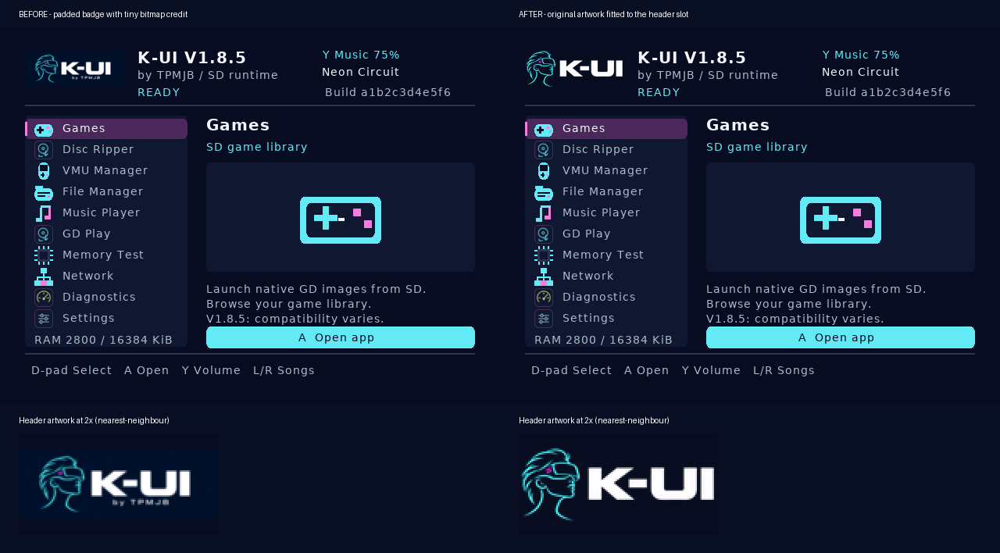

# Launcher header artwork correction

The console photograph `62143.jpg` shows the original padded brand texture
downsampled into a small header slot. Its actual helmet and wordmark occupied
roughly 99x37 pixels, and the raster author credit became only a few pixels tall.
The retained dark-blue matte also appeared as a separate rectangular plaque.

The corrected generator retains the original `launcher-brand.png` unchanged.
It derives a tight helmet/wordmark crop, removes the original dark-blue matte,
scales the artwork to 128x48 with Lanczos, and centers it in the same 128x64 slot.
The bitmap author line is omitted from this derived display; the existing
`by TPMJB / SD runtime` header text remains readable. The art is approximately
27% larger without moving any header text, changing the renderer, or increasing
the embedded pixel storage.



This comparison uses the same RGB565 arrays, font, and `shell_draw.c` renderer
as the console build. The lower crops are shown at 2x using nearest-neighbour
for inspection. It does not simulate the TV's scaling, signal path, or colour
settings; visual confirmation on the console remains necessary.

## Validation

- `python3 tools/generate_shell_art.py --check` passes against all seven pinned
  original source hashes.
- The original brand SHA-256 remains
  `a5d98f17ae66cc549760e98a7907a2c680d4af0d57ea209bab07df7cb7e50355`.
- Both icon arrays are byte-for-byte identical to the previous generated data.
- The brand remains 8,192 RGB565 pixels; total embedded artwork remains
  118,144 bytes. No runtime allocation, decoding, or device reads were added.
- The existing shell controls and rendering suite passes with AddressSanitizer
  and UndefinedBehaviorSanitizer, including safe rendering, Games, File Manager,
  storage tests, FTP, Wi-Fi, VMU, and reversible video actions.
- The host preview builds with `-Wall -Wextra -Werror -Wpedantic` and renders
  the Home/Games page shown above.

Reproduce the asset check and standard host previews with the repository's
ordinary dependency setup:

```sh
python3 tools/generate_shell_art.py --check
make build/test-shell build/render-shell
ASAN_OPTIONS=detect_leaks=0 build/test-shell
build/render-shell home-games build/launcher-home.ppm
```
