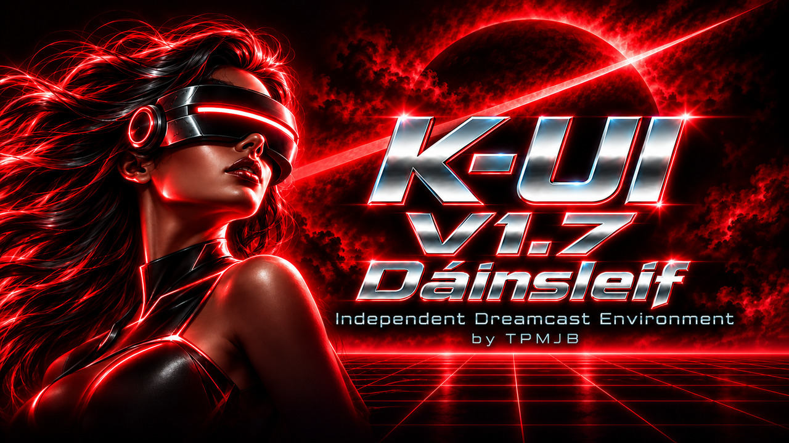
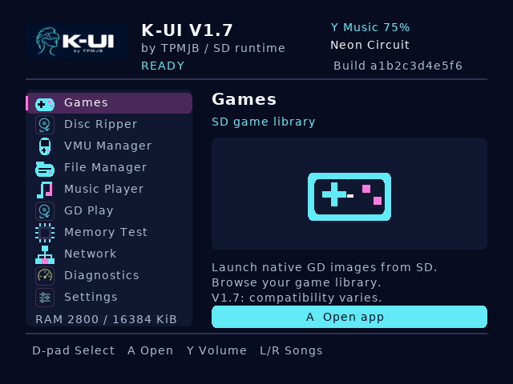
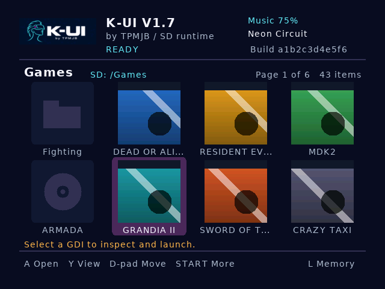
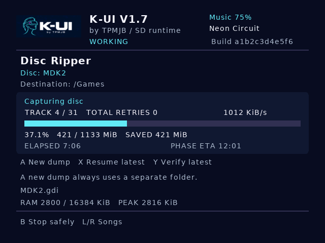
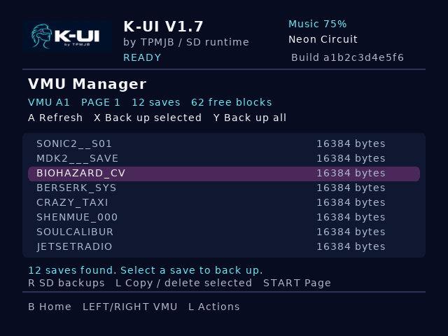
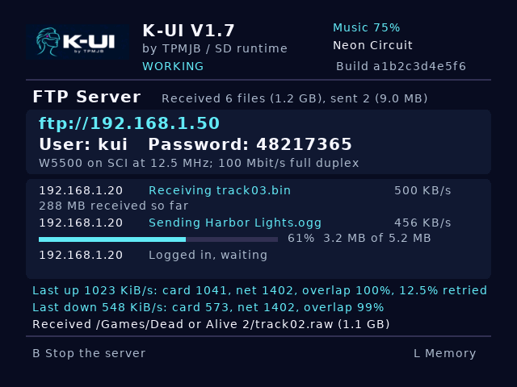
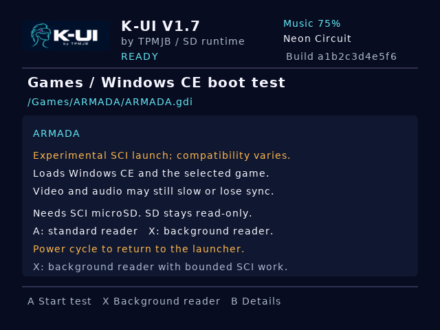

# K-UI V1.7 "Dáinsleif" — release notes

**Windows CE games running from SCI microSD, a much stronger SCI reader and
working W5500 FTP are the headline advances in 1.7.** For readers coming from
the publicly announced DreamShell-based K-UI 1.0, this release introduces the
standalone K-UI foundation, familiar tools implemented for it, and new crimson
artwork for the runtime and graphical boot CD.

K-UI is built directly on upstream KallistiOS with its own shell, capture
engine and game loader. It runs with the original GD-ROM retained. Follow the
[installation guide](release-v1.7.md) to update the runtime and game payloads
together. Existing exFAT/FAT32 cards and game dumps stay usable.

If you'd like to support K-UI development: [TPMJB on Ko-fi](https://ko-fi.com/tpmjb).

## Interface previews

Rendered from the v1.7 release code with example titles, covers, saves,
counters and connection details. These use the release's UI renderer, fonts
and embedded assets. Hardware test results are listed below.

| Launcher: all ten apps, Games first | Games: Gallery view and disc titles |
| --- | --- |
|  |  |

| Disc Ripper: progress, saved bytes and ETA | VMU Manager: saves, free space and backups |
| --- | --- |
|  |  |

| FTP: clients, transfers and status | Windows CE: SCI reader selection |
| --- | --- |
|  |  |

## From K-UI 1.0 to 1.7

K-UI 1.0 began as a DreamShell-based project. Version 1.7 lives in a standalone
repository built on upstream KallistiOS, with K-UI's own bootloader, shell,
capture engine and resident GDI game loader. Both projects use KallistiOS;
the change is the application and loader layer above it. K-UI's focused C
shell uses a fixed renderer and statically linked tools in place of the earlier SDL/Lua/XML app
framework. DreamShell was a valuable starting point; its framework and reader
are not inputs to this build.

Selected original K-UI branding, music and independently authored helpers and
policies carry forward with recorded provenance. KOS and other dependencies
retain their own credits and licenses. Familiar app names do not imply full
DreamShell feature or game compatibility: the independent loader has its own
tested limits, and BIOS programming and permanent region writes remain future
work. See [source provenance](../THIRD_PARTY.md) and
[prior-work reuse](prior-work-reuse.md).

Coming from the DreamShell-based 1.0 CD? Burn the supplied 1.7 CDI to boot
this independent runtime. Reusing a boot CD applies to compatible independent
K-UI bootstraps; see the [installation guide](release-v1.7.md).

### Windows CE reaches real games

- A separate CE loader places the kernel safely and serves CE's virtual-memory,
  GD streaming and completion contracts. ARMADA has reached gameplay and Worms
  Armageddon has booted and run on the owner's Dreamcast from SCI microSD.
- The background reader integrates through CE's interrupt handler table,
  receives blocks by SCI DMA and queues CRC-checked data while CE supplies
  destination buffers. Physical and virtual destinations use their appropriate
  delivery paths.
- Long SD token searches can yield and resume at the same block, reducing the
  amount of token polling in one CE service entry. **1.7 retains the 256-byte
  allowance from `6f14bc529472`.** The newer 512-byte experiment is rejected
  following the owner's report of unclear audio.
- The live CE speed overlay is suppressed during playback. Boot, error and
  return reports remain available without the continuous overlay redraw.

Select a CE image in Games, open its CE confirmation and press **X** for this
background reader. **A** retains the standard-reader comparison. The separate
payload is still named `ce-probe.kui`. This path remains experimental,
SCI-only and title-dependent; it does not promise full-speed FMVs or exact
audio/video synchronization.

### Faster SCI storage and background native-game reads

- Runtime storage adds an original bounded SCI DMA path, leaner receive-clock
  feeding, word-level bit reversal and grouped CRC processing. Polling remains
  available when DMA is unavailable or unsuitable.
- A streaming SCI game reader starts receiving the next block while checking
  and copying the previous one. Sequential requests can retain their CMD18
  stream and reuse a block shared across requests.
- Native games can choose the standard reader with **A**, background SCI with
  20-block call batches using **X**, or 25-block batches using **Y**. The latter
  is the owner's preferred tested DOA2 setting. Background-reader layout limits
  and fallback to the standard reader remain explicit.
- Standard game-read pacing now uses the actual programmed scanline period;
  this fixes a video-mode-dependent defect that prevented larger batches from
  activating in the captured DOA2 session.
- The independent loader's launch maps allow **99 tracks**, expanding its
  earlier 16-track map. Image, allocation, payload and memory checks remain.

Storage throughput and game performance are different measurements. The
console results below document both without treating a storage benchmark as
a frame-rate or compatibility result.

### One layout across SCIF, SCI and IDE/CF

- Bootstrap, runtime and native game loading select standalone external SCIF
  SD, internal SCI microSD or IDE/CF. Each uses `/KUI` and `/Games`; only the
  selected transport's reader stays resident during gameplay.
- Automatic discovery tries SCIF, SCI, then IDE/CF. Manual source selection is
  available in the graphical boot menu. A failed operation does not silently
  continue on another device.
- **Experimental ATA PIO preparation** adds bounded eight-sector reads,
  whole-sector PIO copies and fixes to device selection and IDENTIFY capability
  checks. It is included for future IDE/CF hardware work, with no measured
  speed or compatibility claim.

ATA/IDE/CF remains **untested on physical hardware**. This release does not
implement ATA DMA or Windows CE on ATA/SCIF. The intended CF arrangement keeps
the GD-ROM master and adds an ATA slave; that board and coexistence still
require hardware validation.

### W5500 Ethernet and FTP

- Network detects a W5500 wired to SCI, inspects its link and runs DHCP,
  address-conflict, gateway ARP and ping checks. Existing BBA/LAN inspection
  and test paths remain available.
- The new FTP server browses, uploads, downloads, renames, moves and deletes
  card files, with download resume, passive/active mode and up to three clients.
  The status page shows clients, progress, rates and events.
- Uploads use temporary files and take their final names only after completion.
  Replacements preserve the previous file through finalization, and K-UI's
  startup payloads are protected.
- Network DMA and card I/O can overlap. A hardware-confirmed W5500 closing-state
  workaround removes the prolonged transfer-start slowdown after directory
  listings.

The tested setup uses W5500 on SCI and card storage on SCIF. SCI microSD owns
the same port and cannot be used simultaneously with W5500 here. FTP is plain
local-network FTP; uploads do not support resume. See [FTP](ftp.md).

### Boot menu, recovery, file tools and presentation

- A graphical crimson boot menu adds source selection, card retry, retained
  recovery-image loading, diagnostics and optional card tools. Unchanged
  screens avoid repeated redraws during normal runtime loading.
- Compatible future boot-menu updates can be supplied as an optional card
  image, while the built-in CD path remains available. The CD also has a
  read-only clean-ext4 runtime loader; full ext4 app access is future work.
- File Manager browses folders and opens games, music and pictures. Checked
  copy/move/rename/delete operations preserve startup files; copies are read
  back before finalization. Its console acceptance remains pending.
- Diagnostics adds Quick, Compare and verified Soak storage tests, saved
  baseline comparisons and asynchronous SCI diagnostics.
- Clock edits synchronize the BIOS timestamp after confirmation, and new file
  dates follow the console's clock.
- New crimson cyberpunk artwork refreshes the runtime and boot presentation
  while retaining the Dáinsleif name.

## The complete K-UI toolkit

The release brings these advances alongside the established tools:

- **Games:** owned GDI browsing, disc titles, cover art and List/Compact/Gallery
  views, native launch and the experimental SCI CE path.
- **Disc Ripper:** raw-track GDI capture, named destinations, checkpoints,
  controlled stop/resume, saved-file verification, CRC/reference comparison,
  progress/ETA and separate salvage/retry tools.
- **VMU Manager:** save browsing, verified card backups, restore and managed
  copy/delete with confirmations. The owner has confirmed a deleted THPS2 save
  usable again after restore.
- **File Manager, Music Player, GD Play, Memory Test, Network, Diagnostics and
  Settings:** card management, Ogg/WAV menu music, audio-CD playback, physical
  disc launch, allocated-RAM checking, network tools and console settings.

The accepted optical capture engine remains in place. Its measured complete
Sword of the Berserk and MDK2 dumps took about twenty minutes and matched TOSEC
on the console and PC. MDK2's 31 tracks included 27 audio tracks. Interrupted
captures have resumed to verified completion. These are existing hardware
results carried forward, rather than new 1.7 performance measurements.

## Hardware evidence

These results come from the owner's physical Dreamcast. They are scoped to the
recorded build, media and test; the final release build has its own source ID.

| Area | Recorded result | Scope |
| --- | --- | --- |
| External SCIF storage, `3a368ddcfaff` | 336 MiB written, remounted and verified in the 15-minute soak; zero reported errors; 612 KiB/s reads | Filesystem test baseline |
| Optimized SCI storage, `93794e47df59` | 160 MiB written, remounted and verified in five minutes; zero reported errors; about 1,068 KiB/s reads and 1,201 KiB/s writes | Filesystem-call rates, not gameplay |
| SCI async streaming, `bac1b152b4ac` | Verified 1 MiB stream at 1,202 KiB/s with the test's CRC32 included | Diagnostic reader, not a universal game rate |
| Native DOA2, `90f22512c808`, Y/25 | Owner preferred it as the most fluid of the background-reader runs | Gameplay observation; no full-game or frame-rate claim |
| ARMADA and Worms Armageddon, `6f14bc529472` | Owner reported some improvement; ARMADA counters confirm token yielding; Worms intro audio led video by roughly half a second | Experimental CE; sync and FMV limitations remain |
| Later SCI512 comparison | Owner reported unclear audio and requested the prior SCI fix for 1.7 | Rejected; not the release setting |
| W5500 FTP | Console reports around 0.8 MiB/s uploads and 0.5 MiB/s downloads in tested overlapping-transfer builds; closing-state fix hardware-confirmed before merge | W5500 + SCIF, dependent on media/music/load |
| Optical capture | Sword and MDK2 about 19.6 minutes, matching reference tracks | Established SCIF capture baseline |
| ATA and File Manager | Host validation and implementation; physical acceptance pending | No hardware performance claim |

The [1.7 SCI baseline record](evidence/v1.7-sci-baseline-2026-10-04.md)
identifies the retained setting and owner observations. Detailed source records
remain in [the handoff](HANDOFF.md), [SCI storage evidence](evidence/sci-inline-crc-result-2026-10-01.md),
[background-reader evidence](games-background-reader.md),
[streaming-reader evidence](evidence/sci-async-cmd18-stream-2026-10-02.md) and
[disc-reader evidence](HANDOFF-disc-reader.md).

## Compatibility and remaining limits

| Area | 1.7 behavior |
| --- | --- |
| Game image | Raw 2352-byte GDI tracks, zero file offsets; suitable GD boot layout and metadata required |
| Track/extent limits | Up to 99 tracks; tracks and physical file extents share 160 slots in the standard reader, 64 in background SCI |
| Application filesystem | exFAT/FAT32; full ext4 runtime use is not enabled |
| Native game transports | SCIF and SCI; experimental, hardware-untested IDE/CF PIO |
| Windows CE | Experimental SCI-only launch; ARMADA/Worms evidence does not establish other-title compatibility |
| Image-backed CD audio | Playback commands accepted silently; music on CD-audio tracks is absent |
| Game return | A+B+X+Y+Start when the game invokes the BIOS menu; otherwise power cycle |
| Saves and full-game coverage | VMU tools have scoped owner tests; broader game save/load and completion remain unproven |
| W5500 with SCI storage | Unavailable together on the same SCI port |
| ATA DMA | Not implemented; G1 DMA and original drive interrupt integration remain future work |
| BIOS/region maintenance | Read-only inspection and verified backups; BIOS programming and permanent region writes are not implemented |

Preparation success establishes that an image fits the reader's checks.
Games may still load slowly, lose CD-audio music, exhibit FMV/audio issues or
stop on an unsupported request. Serial storage has real performance limits;
1.7 claims neither universal compatibility nor full-speed game playback.

## Package and source

`kui-1.7-dainsleif-release.zip` contains the normal runtime, native and CE
payloads, Ogg menu music, reference catalogues, optional boot CDI, splash
preview, installation notes, source identity, checksums and licenses. It
excludes game dumps and preferences. Merge its supplied files into the
existing card rather than replacing the entire directory.

`kui-1.7-dainsleif-source.zip` provides corresponding K-UI source, dependency
pins and license records. `build.json`, `SOURCE.txt` and checksums connect
the installation to the exact source. Previous releases and recorded tested
baselines remain available for rollback.
