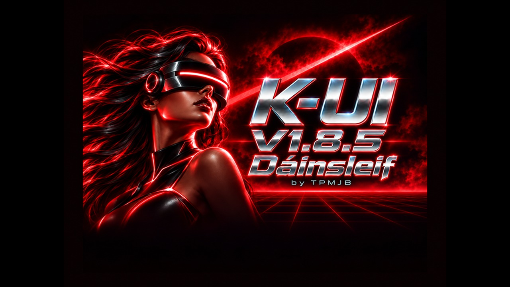

# K-UI V1.8.5 "Dáinsleif" — release notes

**Sonic Adventure, Grandia II and Skies of Arcadia now work in the owner's
hardware tests.** Version 1.8.5 fixes the native reader's memory placement,
expands Games image formats, groups Original/2048 copies, and makes page
navigation responsive after the initial catalogue scan. Disc Ripper adds
selectable BIN/CUE and compressed exports. The splash and version display
identify **1.8.5**, retaining the Dáinsleif artwork and name.

K-UI is an independent Dreamcast shell built on upstream KallistiOS, retaining
the GD-ROM and supporting exFAT/FAT32 storage. Update the runtime and Games
payloads together using the [installation guide](release-v1.8.5.md). Keep your
compatible independent K-UI boot CD; no reripping or conversion is required.

Development support: [TPMJB on Ko-fi](https://ko-fi.com/tpmjb).

## Native compatibility correction

The native reader previously occupied memory also used by startup stacks in
Sonic Adventure and Grandia II. Their GD command parameter arrays landed inside
that reservation and were correctly rejected. Moving the native reader and its
private stack below the IP image clears that conflict without changing either
game's instructions or stored image bytes.

The owner confirmed **Grandia II, Sonic Adventure and Skies of Arcadia** working
on build `5973741a6077`. The same placement is now the normal native default.
Power Stone 1 and 2 were fixed earlier by GD command-contract corrections;
the owner reported fluid gameplay. A Japanese optimized BIN/CUE Dead or Alive 2
also booted in earlier testing. These are scoped owner observations, not full
playthroughs, all-region guarantees or proof that every supported image works.

Guest memory checks still protect firmware and the resident reader. Before
installation, the temporary stage checks retained BIOS service vectors and
rejects unsupported placement. Windows CE keeps its separate, existing layout.
Custom BIOS, every firmware scratch path and multidisc/GINSU behavior have not
all been validated. See the
[hardware and placement evidence](evidence/native-low-resident-2026-10-06.md).

**Time Stalkers remains unresolved.** Its supplied screen reports `GAME RETURN`
with guard zero, rather than the Sonic/Grandia parameter rejection. That records
a menu-return path; it does not identify why the title chose it. No speculative
title patch is included in 1.8.5.

## Games catalogue and Original/2048 selection

- Four recently visited folders share a bounded RAM catalogue. Background idle
  work warms `/Games`; page navigation reuses discovered rows.
- Rows appear before artwork. Only the selected game's cover loads, with a
  bounded cache for both found and missing art. Stale requests cannot replace
  the current selection's cover.
- Matching `Game` and `Game-2048` sibling folders collapse into one entry with
  an **Original / 2048-byte copy** picker. Images that cannot be safely paired
  remain individually accessible.
- The batch GDI converter reports conversions, skips and failures, with an
  optional JSON report. Originals remain unchanged. Keep those originals for
  games requiring full raw data sectors.

The owner reports roughly **5–7 seconds for initial Games entry**, followed by
fluid navigation. That is a collection-specific observation, not a launch-time
guarantee. First discovery and explicit Refresh still read storage. Shared
BIN/CUE prelaunch checks can take longer than ordinary GDI preparation; the
reported approximately 12-second case remains a preparation limitation.

See [Games formats](games-formats.md), [conversion](gdi-2048-test.md), and the
[catalogue/format evidence](evidence/games-ram-rip-formats-2026-10-06.md).

## Expanded image formats

| Format | Games in 1.8.5 |
| --- | --- |
| GDI | Direct launch; supported raw 2352-byte and cooked 2048-byte tracks |
| ISO | Direct launch; complete Dreamcast data session with valid boot metadata |
| BIN/CUE | Direct launch; supported shared/separate BINARY track layouts and sessions |
| CDI | Direct launch; supported DiscJuggler v2, v3 and v3.5 layouts |
| Standalone BIN/IMG | Direct launch; supported 2352-byte Mode 1/Mode 2 Form 1 data track |
| CSO/ZSO/CHD | Computer import using the supplied tool; no resident compressed boot decoding |

Native CD confirmation uses **L/R triggers** to choose **Plain / Scrambled**
boot encoding. CUE can provide a default; confirmation can override it. Track/session geometry,
file offsets and allocation are validated instead of inferred solely from
extensions. The supported data path extracts Mode 1/Mode 2 Form 1 payloads
from 2048/2336/2352/2448-byte backing where the descriptor supports them.

CDDA playback, Mode 2 Form 2, subchannel emulation, WAV/MP3 CUE tracks,
NRG, MDS/MDF, CCD and arbitrary archive loading are not implemented. The
[formats guide](games-formats.md) records exact layout and import boundaries.

## Disc Ripper output choices

**GDI, BIN/CUE, CSO, DreamShell-LZO ZSO and CHDv4** can be selected for new
captures. GDI remains the default; existing checkpoints keep their format.

BIN/CUE describes the captured raw tracks. Compressed exports run after full
raw-file verification and are read back through their decoder against the
capture. Raw files, checkpoint records and `.capture.gdi` remain available for
resume, verification and independent catalogue comparisons. This adds export
time and requires space for both forms.

CSO/ZSO represent one cooked high-density data track; audio and other tracks
remain in the retained raw capture. CHD includes the captured data/audio
mainchannel tracks with declared synthetic padding. Missing physical gaps and
subchannels are not claimed captured. These formats expand output choices,
not compressed Games boot support.

Generated fixtures and FAT32/exFAT host jobs verify decoding, cancellation,
resume, damaged-export preservation and zero-write Verify. Independent zlib,
LZO and CHD readers validate the containers. The established raw acquisition
engine has hardware evidence; the new compressed export flows still need
their own console acceptance. See [ripper controls](ripper-controls.md) and
[capture format](capture-format.md).

## Windows CE and optical idle

Windows CE now defaults to its **background SCI reader** on confirmation with
**A**. The regular reader that blackscreened in recent tests is no longer
offered. A map too large for the background reader fails with an explanation
instead of silently selecting that broken path. CE remains SCI-only,
experimental and title-dependent; ARMADA and Worms Armageddon have run, with
imperfect audio/FMVs. The accepted 256-byte token-search allowance remains.

The boot/runtime screen requests optical STOP, and idle title detection stays
parked until observed media removal/insertion. Explicit optical applications
can start the drive normally. Updating the SD runtime applies the runtime
policy with an existing compatible CD; updating the CD's own first screen
requires the new CDI. Firmware behavior and physical spin-down timing are
not guaranteed by the command result alone. See
[optical-idle evidence](evidence/launch-recovery-disc-stop-2026-10-06.md).

## Established tools and supported hardware

The ten-app shell retains Games, Disc Ripper, VMU Manager, File Manager,
Music Player, GD Play, Memory Test, Network, Diagnostics and Settings. It
includes verified/resumable raw capture, salvage tools, catalogue comparison,
VMU backups/restoration, music and audio-CD playback, checked file operations,
and the graphical boot/recovery menu.

exFAT is the primary working-card setup; FAT32 remains supported. ext4 is a
read-only bootstrap capability, not runtime application or game-library
support. SCIF and SCI have separate readers. IDE/CF remains untested
synchronous PIO; ATA DMA and Windows CE on IDE/SCIF remain future work.

SCI Wi-Fi integration for XIAO ESP32-C5/C6 and its separate board firmware are
preserved from the current main branch. C5 supports 2.4/5 GHz band selection;
C6 uses 2.4 GHz. Network **Start** opens scan/join/band settings, and FTP uses
the board's sockets. Firmware is flashed from a computer over USB; K-UI does
not expose a console firmware-update workflow. SCI networking requires storage
on SCIF because SCI storage reserves that port. See [Wi-Fi](wifi.md).

W5500 Ethernet/FTP remains available in the same SCI-network/SCIF-storage
arrangement. This release makes no new Wi-Fi or Ethernet throughput claim;
the separate Wi-Fi speed experiments are not evidence for this exact merged
build. See [FTP](ftp.md) and [transport support](storage-transports.md).

The K-UI shell is GPL-3.0-only except where stated. The separate Wi-Fi firmware
and shared kwlink library are MIT; dependencies retain their own notices and
corresponding source records. See [source and licenses](../THIRD_PARTY.md).

## Remaining compatibility limits and validation

- **Time Stalkers:** reported nonboot/menu return; cause unresolved.
- **Some FMVs:** repeated short audio followed by a stall/skip in both Original
  and 2048 modes. No movie-specific skip logic is present; the underlying
  read/completion/timing cause remains unproven.
- **Compressed Games:** PC import is required. On-device export does not
  supply a resident compressed reader.
- **Windows CE:** background SCI only, with limited audio/FMV compatibility.
- **IDE/CF, custom BIOS and multidisc paths:** require further hardware work.

Host checks use generated, independently expected image data and real
disposable FAT32/exFAT images. They check parsing, exact prepared bytes,
read-only launch behavior, catalogue/cancellation behavior and compressed
export verification. Native builds audit all reader layouts, entry/stage
headers, embedded payloads, instruction use and private stack budgets.
Release packaging checks build/source identity and supplies corresponding
source and licenses. Those checks complement the scoped console results;
they do not establish universal compatibility or new throughput figures.
