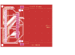

# CF board: CompactFlash inside the Dreamcast

**Rev 1, designed 2026-09-29. Not yet made or tried.** A small board that
puts a CompactFlash card on the GD-ROM drive's bus (the G1 ATA bus) as its
second device, inside the console. The GD-ROM drive stays the first
(master) device and keeps working. The card is the slave, as KallistiOS's
`g1ata` driver expects: "The GD-ROM drive should always be the master
device on the chain, but you can hook up a hard drive or some other device
as a slave" (`dc/g1ata.h`).

K-UI cannot use the card yet. The storage rework and a G1 ATA path come
next on the software side (see [the handoff](../../docs/HANDOFF.md)). The
board can be made and fitted before then: at power-up the console should
behave exactly as before.

| Top (card side) | Underside |
| --- | --- |
|  |  |

- [Schematic (PDF)](docs/cf-board-schematic.pdf)
- [Fit template, print at 100 % (PDF)](docs/cf-board-fit-template.pdf)
- [Gerbers for the board house](fab/cf-board-gerbers.zip),
  [parts list](fab/cf-board-bom.csv),
  [part positions](fab/cf-board-positions.csv)

## What the photos of the VA1 board show

From the owner's photos of both sides, with a ruler, sent on 2026-09-28:

- **CN503, the drive connector, is surface-mounted:** two rows of 25 legs at
  1.0 mm spacing. The A legs (A1 to A25, as printed on the board) run along
  the side facing the middle of the board. The B legs run along the side
  facing the board edge. Nothing comes through to the underside, so the
  wires are soldered to these legs.
- **The underside, under CN503,** has a grid of round test pads and the
  33 ohm resistor arrays in the drive's lines (RA507 to RA515 and others).
  The test pads would be easier to solder to than the legs, but nothing
  printed says which signal each carries (see
  [Using the test pads](#using-the-test-pads-instead)).
- **SCI connector points:** R115, R140 (beside IC105) and CE113 are on the
  underside. R122 and RA101 are not yet found in the photos. These matter
  for the [SCI connector plan](../../docs/sci-connector.md), not this board.

## How it connects

Each pad on the board takes one wire from the CN503 leg of the same name:
pad A4 to leg A4, pad B11 to leg B11. The pads are labelled A1 to A21 and
B1 to B21 on top, and with their signals on the underside. The CN503 signal
names follow the [iceGDROM](https://github.com/zeldin/iceGDROM) riser
board, which plugs into the same connector.

| Leg / pad | Signal | CF pin | Leg / pad | Signal | CF pin |
| --- | --- | --- | --- | --- | --- |
| A1 | +3V3 | JP1 (card supply) | B1 | +3V3 | JP1 (card supply) |
| A2 | /RESET | 41 (/RESET) | B2 | (unused) | leave unwired |
| A3 | +5V | JP1 (card supply) | B3 | +5V | JP1 (card supply) |
| A4 | D7 | 6 (D7) | B4 | D6 | 5 (D6) |
| A5 | D8 | 47 (D8) | B5 | D9 | 48 (D9) |
| A6 | D5 | 4 (D5) | B6 | D4 | 3 (D4) |
| A7 | D10 | 49 (D10) | B7 | D11 | 27 (D11) |
| A8 | GND | ground | B8 | GND | ground |
| A9 | D3 | 2 (D3) | B9 | D2 | 23 (D2) |
| A10 | D12 | 28 (D12) | B10 | D13 | 29 (D13) |
| A11 | D1 | 22 (D1) | B11 | D0 | 21 (D0) |
| A12 | D14 | 30 (D14) | B12 | D15 | 31 (D15) |
| A13 | GND | ground | B13 | GND | ground |
| A14 | DMARQ | 43 (DMARQ) | B14 | /DIOW | 35 (/IOWR) |
| A15 | /DIOR | 34 (/IORD) | B15 | IORDY | 42 (IORDY) |
| A16 | /DMACK | 44 (/DMACK) | B16 | INTRQ | 37 (INTRQ) |
| A17 | (unused) | leave unwired | B17 | DA1 | 19 (A1) |
| A18 | GND | ground | B18 | GND | ground |
| A19 | DA0 | 20 (A0) | B19 | DA2 | 18 (A2) |
| A20 | /CS0 | 7 (/CS0) | B20 | /CS1 | 32 (/CS1) |
| A21 | GND | ground | B21 | GND | ground |

**Never wire A22 to A25 or B22 to B25.** They carry CD audio, ground and,
on A25 and B25, **+12 V**, which would destroy the card. A3 and B3 (+5 V)
are needed only if the card is ever switched to 5 V (JP1, below).

That is 28 signal wires, 2 for 3.3 V and 8 for ground. Wire every ground:
the grounds are the return path for the 16 data lines.

## Wiring it

1. **Check the connector's orientation first, with the console unplugged.**
   Put a multimeter on continuity. Legs A21 and B21 must beep to ground
   (the metal shield, or the shell of the AV connector). Leg A5 must not.
   Leg A1 must beep to leg B1 (both are 3.3 V). If the connector were turned
   end to end, A21 would be a data line and would not beep. If anything
   disagrees, stop and send a photo: the numbering differs from what this
   board expects.
2. Use thin insulated wire, such as 30 AWG wire-wrap wire, about 10 to 15 cm
   long and no longer than the chosen spot needs.
3. Tin each leg lightly, lay the wire on it, and touch it with a fine tip
   and flux. Keep solder off the connector's plastic and out of its
   opening. Lay the wires flat along the board so the GD-ROM drive still
   seats fully in CN503.
4. Solder the other end of each wire to the pad of the same name.
5. Before powering: check continuity from each leg to its pad; check that
   no two neighbouring legs are bridged, in both rows; and check there is
   no short between C1's two ends (the card supply and ground).

## Before and at first power-up

- **JP1** (underside) comes bridged between 1 and 2: the card runs from
  3.3 V. To run it from 5 V instead, cut the thin trace between pads 1 and 2
  and bridge 2 and 3. Stay on 3.3 V unless a measurement says otherwise
  (see the design notes).
- **JP2** (underside) stays open: the card is the slave. Bridging it makes
  the card the master, for trying the board on a PC's IDE port only.
- Fit a CompactFlash card. Any size will do; True IDE mode is part of every
  CF card.
- Power up with the drive connected. The console must start and read discs
  exactly as before. The ACT LED (underside) lights briefly at start-up as
  the card announces itself, and later while the card is busy.

## Making it

- **Board:** 2 layers, 1.6 mm, 66.5 x 54 mm, any colour. Upload
  [cf-board-gerbers.zip](fab/cf-board-gerbers.zip). It fits the standard
  service of the usual board houses: 0.25 mm tracks, 0.2 mm spacing,
  0.3 mm drills. Choose **ENIG** (gold) plating if offered: its flat pads
  make the socket's 0.635 mm pins easier to solder by hand.
- **Parts:** [cf-board-bom.csv](fab/cf-board-bom.csv). The socket is a 3M
  N7E50-E516PG-30 CompactFlash header. The rest are 0805 resistors,
  capacitors and an LED.
- **Order of soldering:** the CF socket first (flux, tack two corner pins,
  drag-solder the rest, then check every gap with a magnifier), then the
  underside parts. The wire pads get their wires last, at the console.

## Where it goes

The board with a card fitted is about 7 mm thick in all, and the card
slides in from the right-hand edge. Print the
[fit template](docs/cf-board-fit-template.pdf) at 100 %, check that its bar
measures 50 mm, cut out the outline, and try it inside the console with
the drive and the power supply fitted. Double-sided foam tape holds it; the
two M2 holes also take nylon screws, and tracks stay 2.4 mm clear of them.
If no spot fits, the outline can change: the whole design is regenerated
from [tools/design.py](tools/design.py).

## Using the test pads instead

The round pads on the underside under CN503 are probably test points for
the same signals, which would make easier solder points. That is not
confirmed. To use them: with the board out and unplugged, beep from each
CN503 leg (top side) to the test pads (underside), write down the pad for
each signal in a copy of the table above, and send the list for checking
before soldering. Any signal without a test pad is wired at its leg.

## Design notes

- **3.3 V card supply.** The iceGDROM emulator drives these lines straight
  from a 3.3 V chip, so the Dreamcast's side works at 3.3 V. The GD-ROM
  drive's own output level is not documented. If it drove 5 V onto the bus,
  a card running at 3.3 V would be stressed. JP1 allows 5 V operation, as
  the iceGDROM riser's slave connector does. The level can be settled by
  measuring a data line while the drive reads a disc, before a card goes in.
- **The row names agree.** On the iceGDROM riser, the A row and the A25
  end face the riser's body, which lies over the middle of the mainboard,
  where the drive sits. That matches VA1's silkscreen, with A1 to A25 along
  the side of CN503 facing the middle of the board. The orientation check
  in the wiring steps catches a connector turned end to end.
- **No series resistors** on the board. The Dreamcast already has 33 ohm
  resistors in these lines. With short wires and a single card, the board
  stays simple, like the usual IDE modification.
- **No master/slave handshake with the drive.** The drive connector carries
  neither DASP nor PDIAG. The card's DASP line drives the ACT LED, and
  PDIAG has its own pull-up.
- **True IDE mode:** ATA SEL (pin 9) and A3 to A10 are grounded, and WE
  (pin 36) is held high. CSEL (pin 39) is left open, so the card is the
  slave. The CF pin assignments were checked against published True IDE
  tables.
- **The socket's footprint** is KiCad's `CF-Card_3M_N7E50-E516xx-30`, with
  the copper rings of its two unconnected board-lock holes cut from 3.99 to
  3.2 mm, so that they clear the locating holes by 0.55 mm instead of
  0.155 mm (`cf-board.pretty`).

## Files and checks

- `cf-board.kicad_pro`, `.kicad_sch`, `.kicad_pcb`: the KiCad 7 project.
  `cf-board.kicad_sym` holds the socket's symbol, and `cf-board.pretty` its
  footprint.
- `tools/design.py`: the connector pinouts, the parts and every
  connection, in one place. `tools/build.sh` rebuilds everything from it:
  schematic, netlist check, placement, autorouting with Freerouting 1.9,
  ground pours and stitching, DRC, and the files in `fab/` and `docs/`.
- `tools/check_netlist.py` compares KiCad's netlist, from the schematic and
  again from the finished board, with `design.py`. It stands in for ERC,
  which KiCad 7's command line lacks. `tools/drc.py` runs KiCad's DRC.

For rev 1, both netlist checks found 36 nets, 102 connections and no
problems. The DRC found no violations and no unconnected pads, and every
footprint matches its library.
